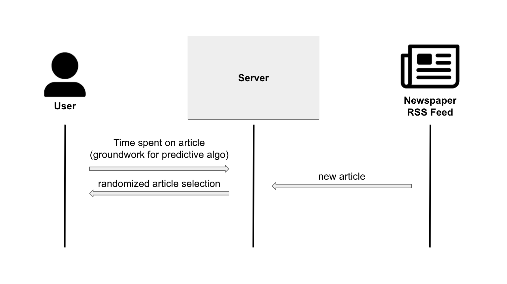

# Quilted News

[My Notes](notes.md)

Simple news aggregation application. 

> [!NOTE]
>  This is a template for your startup application. You must modify this `README.md` file for each phase of your development. You only need to fill in the section for each deliverable when that deliverable is submitted in Canvas. Without completing the section for a deliverable, the TA will not know what to look for when grading your submission. Feel free to add additional information to each deliverable description, but make sure you at least have the list of rubric items and a description of what you did for each item.

> [!NOTE]
>  If you are not familiar with Markdown then you should review the [documentation](https://docs.github.com/en/get-started/writing-on-github/getting-started-with-writing-and-formatting-on-github/basic-writing-and-formatting-syntax) before continuing.

## 🚀 Specification Deliverable

> [!NOTE]
>  Fill in this sections as the submission artifact for this deliverable. You can refer to this [example](https://github.com/webprogramming260/startup-example/blob/main/README.md) for inspiration.

For this deliverable I did the following. I checked the box `[x]` and added a description for things I completed.

- [x] Proper use of Markdown
- [x] A concise and compelling elevator pitch
- [x] Description of key features
- [x] Description of how you will use each technology
- [x] One or more rough sketches of your application. Images must be embedded in this file using Markdown image references.

### Elevator pitch

Traditional print news apps largely employ similar web designs, essentially appearing as a list of article links. A news aggregation site that simply queues and shows the reader articles would provide opportunities for increased content targeting. I plan to create the first bit of the app, including a mechanism to view and swipe through articles from a database of webscraped local news articles.

### Design

Above is a diagram for my main page layout

And next is a diagram explaning the backend page design

### Key features

- Displays article titles, authors, publishing dates, and article content from a database of local news sources
- Allows users to swipe from article to article (laying the foundation for the future implementation of a predictive algorithm serving readers the stories they are most interested in)
- Uses an RSS feed from at least one news source to scrape and pull newly published articles into the app's database

### Technologies

I am going to use the required technologies in the following ways.

- **HTML** - Two HTML page formats. One for login and another - utilizing varying content - to display actual articles.
- **CSS** - Application styling ensuring readablility and a consistent brand feel across screen sizes and applications.
- **React** - Simple swiping application with views componetized and reactive to user's actions.
- **Service** - Background service with endpoints for:
    - Randomizing which article is displayed to user
    - Retrieving time user spends on an article
- **DB/Login** - Store users. Track time users spend on articles, - prepping for an eventual recommendation algorithm that I won't plan on implementing in this class. Register and login users. Credentials securely stored in database.
- **WebSocket** - When a new article is added to database, user is notified and article is bumped to from of queue

## 🚀 AWS deliverable

For this deliverable I did the following. I checked the box `[x]` and added a description for things I completed.

- [x] **Server deployed and accessible with custom domain name** - [My server link](https://quiltednews.com).

## 🚀 HTML deliverable

For this deliverable I did the following. I checked the box `[x]` and added a description for things I completed.

- [x] **HTML pages** - Barebones text in places where it will be permanent
- [x] **Proper HTML element usage** - Yea, I did my best
- [x] **Links** - same header format across pages
- [x] **Text** - text added where appropriate
- [x] **3rd party API placeholder** - 
- [x] **Images** - 
- [x] **Login placeholder** - 
- [x] **DB data placeholder** - 
- [x] **WebSocket placeholder** - Spots for article content to fill in

## 🚀 CSS deliverable

For this deliverable I did the following. I checked the box `[x]` and added a description for things I completed.

- [x] **Header, footer, and main content body** - 
- [x] **Navigation elements** - 
- [x] **Responsive to window resizing** - 
- [x] **Application elements** - 
- [x] **Application text content** - 
- [x] **Application images** - 

## 🚀 React part 1: Routing deliverable

For this deliverable I did the following. I checked the box `[x]` and added a description for things I completed.

- [x] **Bundled using Vite** - Modeled the Simon example
- [x] **Components** - Modeled the Simon example
- [x] **Router** - Likewise, modeled Simon example, switched to router website navigation through .JSX files

## 🚀 React part 2: Reactivity

For this deliverable I did the following. I checked the box `[x]` and added a description for things I completed.

- [x] **All functionality implemented or mocked out** - Created all the .JSX and CSS files for navigating the website
- [x] **Hooks** - Created the spots where I'll eventually call APIs and other backend services to help create the real functionality

## 🚀 Service deliverable

For this deliverable I did the following. I checked the box `[x]` and added a description for things I completed.

- [x] **Node.js/Express HTTP service** - Used to connect front and backend services
- [x] **Static middleware for frontend** - Used middleware for login
- [x] **Calls to third party endpoints** - Made API calls for actual news content
- [x] **Backend service endpoints** - Pulled from API and frontend sources
- [x] **Frontend calls service endpoints** - Pulled from backend sources

## 🚀 DB/Login deliverable

For this deliverable I did the following. I checked the box `[x]` and added a description for things I completed.

- [x] **User registration** - Modeled on Simon - passes info through from frontend to index.js to database.js
- [x] **User login and logout** - Modeled on Simon
- [x] **Stores data in MongoDB** - Stores user preferences on news source in MongoDB
- [x] **Stores credentials in MongoDB** - stores username/password/other data in MongoDB
- [x] **Restricts functionality based on authentication** - blocks access to the articles page without proper authentication

## 🚀 WebSocket deliverable

For this deliverable I did the following. I checked the box `[x]` and added a description for things I completed.

- [x] **Backend listens for WebSocket connection** - Modeled on Simon
- [x] **Frontend makes WebSocket connection** - Modeled on Simon
- [x] **Data sent over WebSocket connection** - Modeled on Simon
- [x] **WebSocket data displayed** - drop down notifications occur (currently at regular intervals)
- [x] **Application is fully functional** - When I simulate the posting of a new article to "Sam's News Source" (currently scheduled for every two minutes), all users who currently have the source selected will get a drop down notification. When clicked, this notification will reroute them to the new article
